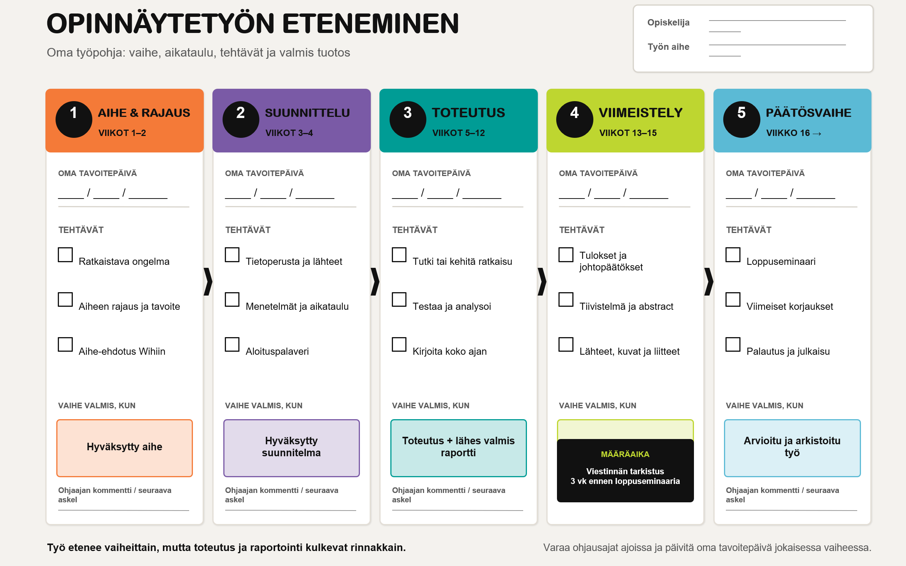

# Opinnäytetyön projektiseuranta ja aikataulu

Opinnäytetyöprojekti etenee seuraavassa mallissa:

```text
1. aihe ja rajaus (1-2vk)
    |
2. Suunnittelu (3-4vk)
    |
3. Toteutus (5-12vk)
    |
4. Viimeistely (13-15vk)
    |
5. Päätös (16vk -->)
```

Tämän repon tarkoitus on tuottaa tästä automaattinen aikataulurunko, perustuen haluttuun loppuseminaaripäivään. Huomioiden viestinnän tarkistuksen, julkaisun ja plagioinnin tarkistukseen kuluvat ajat. Lomake antaa summittaisen arvion kunkin vaiheen valmistumisesta ja ehdottaa aikatauluun liittyviä ajankohtia. Lomake myös ehdottaa ohjauksen ajankohtia, joskin näiden toteutuminen riippuu kulloisenkin projektin etenemisestä.
Alla lomake paperimuotoisena:



## demo julkaisu

Sivustoa pääsee katsomaan livenä [netlify](https://tivi-opparin-eteneminen.netlify.app/)